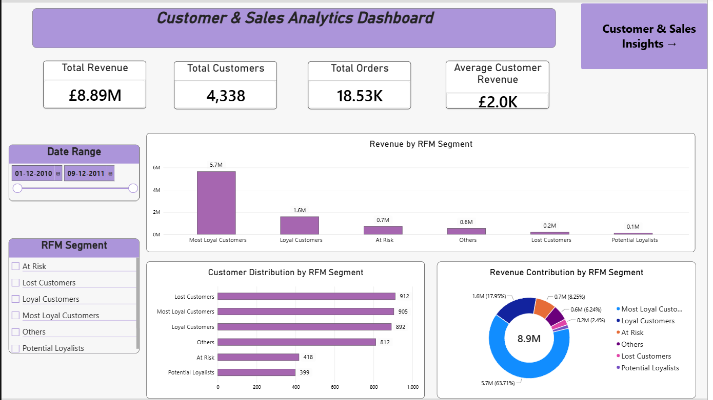
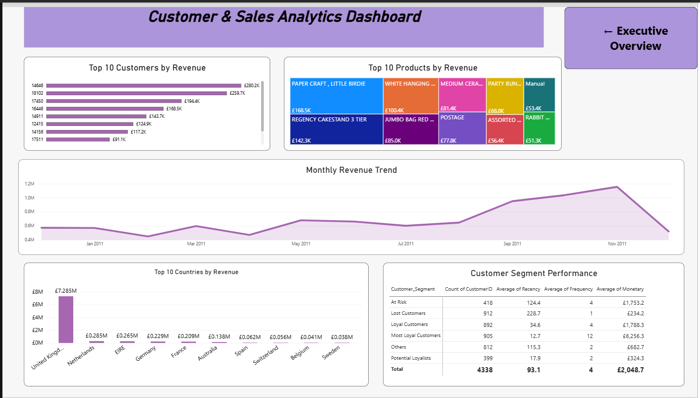
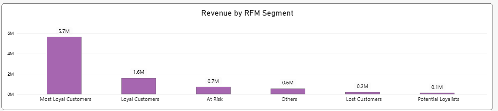
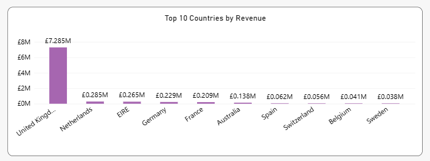
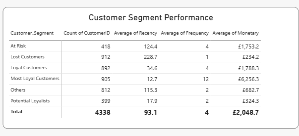

# RFM Customer Segmentation & E-commerce Analytics

An end-to-end **customer and sales analytics project** built using **Python, SQL, RFM Analysis, and Power BI** to understand customer purchasing behavior, identify high-value and at-risk customers, and generate actionable business insights.



---

## 📌 Project Overview

E-commerce businesses generate large volumes of transactional data, but raw transactions do not immediately explain:

- Which customers generate the most revenue?
- Which customers are highly loyal?
- Which customers purchase frequently?
- Which customers are becoming inactive?
- Which customer segments require retention campaigns?
- Which products and countries contribute the most revenue?
- How does revenue change over time?

This project converts historical **Online Retail transaction data** into customer-level insights using **RFM (Recency, Frequency, Monetary) analysis** and presents the results through an interactive Power BI dashboard.

The project combines:

> **Python → Data Cleaning & EDA → SQL Business Analysis → RFM Segmentation → Power BI Dashboard → Business Recommendations**

---

# 🎯 Business Problem

The business has a large amount of historical transaction data but lacks a clear view of customer value and purchasing behavior.

A data-driven approach is required to identify customer segments and understand how different groups contribute to revenue.

### Core Business Question

> **How can historical e-commerce transaction data be used to understand customer purchasing behavior, segment customers using RFM analysis, and identify opportunities for customer retention, engagement, and revenue growth?**

---

# 🎯 Project Objectives

The project aims to:

1. Analyze historical e-commerce transactions.
2. Clean and validate transaction-level data.
3. Understand sales and customer purchasing patterns.
4. Identify high-value customers.
5. Calculate Recency, Frequency, and Monetary metrics.
6. Segment customers based on RFM behavior.
7. Identify loyal, potential, at-risk, and lost customers.
8. Analyze revenue by product and country.
9. Analyze monthly revenue trends.
10. Build an interactive Power BI dashboard.
11. Translate analytical findings into business recommendations.

---

# 📊 Dataset

### Online Retail Dataset

The project uses the **Online Retail** transaction dataset.

Each row represents a transaction line and contains:

| Column | Description |
|---|---|
| `InvoiceNo` | Unique invoice/transaction number |
| `StockCode` | Product identifier |
| `Description` | Product description |
| `Quantity` | Number of units purchased |
| `InvoiceDate` | Transaction date and time |
| `UnitPrice` | Price per unit |
| `CustomerID` | Unique customer identifier |
| `Country` | Customer country |

### Dataset Scale

- **Raw records:** 541,909
- **Columns:** 8
- **Analysis period:** 01 Dec 2010 – 09 Dec 2011
- **Final dashboard customers:** 4,338
- **Final dashboard orders:** ~18.53K

---

# 🧹 Data Cleaning & Preparation

Before performing the analysis, the transaction data was reviewed and cleaned.

### Cleaning steps

1. Inspected the dataset structure.
2. Checked missing values.
3. Identified duplicate transactions.
4. Removed duplicate records.
5. Identified cancelled invoices.
6. Removed cancellation transactions for sales analysis.
7. Handled missing `CustomerID` values.
8. Validated `Quantity`.
9. Validated `UnitPrice`.
10. Converted date fields to appropriate datetime formats.
11. Created transaction-level revenue.

### Revenue Calculation

```text
Revenue = Quantity × UnitPrice
```

This calculated revenue field is then used for customer, product, country, and overall sales analysis.

---

# 🔎 Exploratory Data Analysis

The Python EDA workflow investigates:

### Transaction Analysis

- Transaction volume
- Order activity
- Revenue
- Cancellation behavior
- Quantity distribution
- Price distribution

### Customer Analysis

- Unique customers
- Customer revenue
- Customer purchase frequency
- Customer activity

### Product Analysis

- Product sales volume
- Product revenue
- Top-performing products

### Geographic Analysis

- Customer distribution by country
- Revenue by country

### Time Analysis

- Monthly revenue
- Monthly transaction activity
- Revenue trends

The detailed analysis is available in:

```text
notebooks/EDA.ipynb
```

---

# 🧮 RFM Analysis

The core of the project is **RFM Customer Segmentation**.

RFM evaluates customers across three dimensions.

## Recency

**How recently did the customer purchase?**

A lower Recency value means the customer purchased more recently.

```text
Lower Recency → More Recent Activity
Higher Recency → Longer Inactivity
```

## Frequency

**How frequently does the customer purchase?**

A higher Frequency value indicates stronger purchasing engagement.

## Monetary

**How much revenue did the customer generate?**

A higher Monetary value indicates greater customer value.

```text
Customer
    ↓
Recency + Frequency + Monetary
    ↓
RFM Score
    ↓
Customer Segment
```

The RFM calculations and segmentation logic are implemented in:

```text
sql/RFM_Calculation.sql
```

---

# 👥 Customer Segmentation

The project identifies the following customer segments:

| Segment | Business Interpretation |
|---|---|
| **Most Loyal Customers** | Highly active, frequent, high-value customers |
| **Loyal Customers** | Consistent customers with strong engagement |
| **At Risk** | Customers showing declining activity but with meaningful historical value |
| **Lost Customers** | Customers with very low recent activity |
| **Potential Loyalists** | Customers showing potential for stronger engagement |
| **Others** | Customers that do not fall into the primary strategic segments |

---

# 📊 Power BI Dashboard

The Power BI dashboard provides two main analytical views:

### 1. Executive Overview

Provides a high-level view of:

- Total Revenue
- Total Customers
- Total Orders
- Average Customer Revenue
- Revenue by RFM Segment
- Customer distribution by RFM Segment
- Revenue contribution by RFM Segment
- Date filtering
- RFM segment filtering

### Executive Dashboard


---

## 2. Customer & Sales Insights

The second page provides deeper analysis of:

- Top 10 customers by revenue
- Top 10 products by revenue
- Monthly revenue trend
- Top countries by revenue
- Customer Segment Performance
- Average Recency
- Average Frequency
- Average Monetary value

### Customer & Sales Dashboard



---

# 📈 Key Findings

## 1. Revenue is highly concentrated in Most Loyal Customers

Most Loyal Customers generate approximately:

> **£5.7M**

and contribute:

> **63.71% of total revenue**



This makes the Most Loyal segment the most commercially important customer group.

---

## 2. Most Loyal Customers show the strongest purchasing behavior

| Metric | Most Loyal Customers |
|---|---:|
| Customers | 905 |
| Average Recency | 12.7 days |
| Average Frequency | 12 |
| Average Monetary | £6,256.3 |

These customers purchase frequently, purchased recently, and generate significantly more revenue than the other segments.

### Business implication

The business should prioritize:

- Loyalty programs
- Personalized offers
- Early-access campaigns
- VIP treatment
- Retention initiatives

---

## 3. Lost Customers represent a major retention challenge

There are:

> **912 Lost Customers**

Their average metrics are:

| Metric | Lost Customers |
|---|---:|
| Average Recency | 228.7 days |
| Average Frequency | 1 |
| Average Monetary | £234.2 |

The large recency value indicates that these customers have been inactive for a significant period.

### Business implication

A targeted **win-back strategy** should be considered, especially for customers who previously generated meaningful revenue.

---

## 4. At Risk Customers still have significant value

The At Risk segment contains:

> **418 customers**

with:

- Average Recency: **124.4 days**
- Average Frequency: **4**
- Average Monetary: **£1,753.2**

This is important because At Risk customers still demonstrate substantially higher historical monetary value than Lost Customers.

### Business implication

At Risk customers should be prioritized for **early re-engagement**, before they move into the Lost segment.

---

## 5. At Risk + Lost represent a major retention opportunity

Combined:

```text
At Risk = 418
Lost = 912

Total = 1,330 customers
```

This represents approximately:

> **30.66% of the customer base**

This is one of the most important findings from the project.

The business should not treat all inactive customers equally. Customers should be prioritized according to previous monetary value and purchasing frequency.

---

# 🌍 Geographic Performance

The United Kingdom is the dominant market.



### Top countries by revenue

| Country | Revenue |
|---|---:|
| United Kingdom | £7.285M |
| Netherlands | £0.285M |
| EIRE | £0.265M |
| Germany | £0.229M |
| France | £0.209M |
| Australia | £0.138M |

### Insight

The business is heavily concentrated in the UK market.

This creates two opportunities:

1. Protect the existing UK customer base.
2. Explore growth opportunities in other high-performing markets.

---

# 🛍️ Product Performance

The dashboard identifies the highest-revenue products.

Some of the leading products include:

| Product | Approx. Revenue |
|---|---:|
| PAPER CRAFT, LITTLE BIRDIE | £168.5K |
| REGENCY CAKESTAND 3 TIER | £142.3K |
| WHITE HANGING HEART T-LIGHT HOLDER | £100.4K |

These products can be considered important candidates for:

- Cross-selling
- Product bundles
- Promotional campaigns
- Repeat-purchase campaigns

---

# 👤 Top Customers

The dashboard identifies the highest-value customers.

Examples include:

| Customer | Revenue |
|---|---:|
| 14646 | £280.2K |
| 18102 | £259.7K |
| 17450 | £194.4K |
| 16446 | £168.5K |
| 14911 | £143.7K |

The analysis demonstrates why customer-level revenue analysis is important for identifying high-value accounts.

---

# 📅 Monthly Revenue Trend

The dashboard tracks revenue over time and shows stronger performance during the later part of 2011.

The strongest monthly performance occurs around:

> **November 2011 — approximately £1.16M**

This suggests that seasonal demand, campaigns, or changes in purchasing behavior may have influenced revenue.

Further analysis could investigate the exact drivers of these peaks.

---

# 📋 Customer Segment Performance



The dashboard provides a combined view of customer count and RFM behavior:

| Segment | Customers | Avg Recency | Avg Frequency | Avg Monetary |
|---|---:|---:|---:|---:|
| At Risk | 418 | 124.4 | 4 | £1,753.2 |
| Lost Customers | 912 | 228.7 | 1 | £234.2 |
| Loyal Customers | 892 | 34.6 | 4 | £1,788.3 |
| Most Loyal Customers | 905 | 12.7 | 12 | £6,256.3 |
| Others | 812 | 115.3 | 2 | £682.7 |
| Potential Loyalists | 399 | 17.9 | 2 | £324.3 |

This table clearly demonstrates the behavioral difference between customer segments.

---

# 💡 Business Recommendations

## 1. Protect Most Loyal Customers

The Most Loyal segment contributes the majority of revenue.

Recommended actions:

- VIP loyalty programs
- Personalized promotions
- Early access to products
- Exclusive offers
- Proactive retention

---

## 2. Re-engage At Risk Customers

At Risk customers still have meaningful historical value.

Recommended actions:

- Personalized discounts
- Reminder campaigns
- Product recommendations
- Limited-time offers
- Email reactivation campaigns

---

## 3. Win Back Lost Customers

Lost customers should be approached selectively.

Instead of sending the same campaign to everyone:

```text
Lost Customers
      ↓
Previous Revenue
      ↓
Purchase Frequency
      ↓
Prioritize High-Value Customers
      ↓
Targeted Win-Back Campaign
```

---

## 4. Develop Potential Loyalists

Potential Loyalists can be encouraged to increase purchase frequency through:

- Bundles
- Cross-selling
- Personalized recommendations
- Repeat-purchase incentives

---

## 5. Reduce Revenue Concentration Risk

Because 63.71% of revenue comes from Most Loyal Customers, the business should:

- Protect this segment
- Develop Loyal Customers
- Convert Potential Loyalists
- Recover At Risk customers

This creates a healthier customer portfolio.

---

# 🛠️ Technology Stack

| Technology | Purpose |
|---|---|
| **Python** | Data cleaning & EDA |
| **Pandas** | Data manipulation |
| **Jupyter Notebook** | Exploratory analysis |
| **SQL** | Business analysis & RFM calculations |
| **Power BI** | Dashboard & visualization |
| **Excel** | Source dataset |

---

# 📁 Project Structure

```text
RFM-Customer-Segmentation/
│
├── README.md
├── .gitignore
├── requirements.txt
│
├── data/
│   └── Online Retail.xlsx
│
├── notebooks/
│   └── EDA.ipynb
│
├── sql/
│   ├── Business_Analysis.sql
│   └── RFM_Calculation.sql
│
├── dashboard/
│   └── RFM_dashboard.pbix
│
├── documentation/
│   ├── Business_Problem.md
│   ├── Data_Dictionary.md
│   └── Final_Project_Report.docx
│
└── images/
    ├── dashboard_executive_overview.png
    ├── dashboard_customer_sales_insights.png
    ├── revenue_by_rfm_segment.png
    ├── country_revenue.png
    └── customer_segment_performance.png
```

---

# 📚 Documentation

Additional project documentation:

- **Business Problem** — defines the business context, objectives, scope, and questions.
- **Data Dictionary** — explains the dataset fields and derived analytical metrics.
- **Final Project Report** — detailed findings, dashboard analysis, and recommendations.

---

# ⚠️ Project Limitations

This project is focused on **descriptive and diagnostic analytics**.

It does not include:

- Machine learning-based churn prediction
- Recommendation engines
- Predictive customer lifetime value modeling

The RFM segments represent historical customer behavior and should not be interpreted as guaranteed predictions of future behavior.

---

# 🚀 Future Improvements

Potential extensions include:

- Customer churn prediction
- Customer lifetime value analysis
- Cohort retention analysis
- Sales forecasting
- Product recommendation analysis
- Automated dashboard refresh
- Marketing campaign measurement
- Customer-level profitability analysis

---

# 📌 Final Conclusion

This project demonstrates how raw e-commerce transaction data can be transformed into actionable customer intelligence.

The key finding is the strong contrast between:

**High-value, highly engaged customers**

and

**At Risk / Lost customers with declining activity.**

The RFM framework makes this difference measurable, while the Power BI dashboard allows business users to explore the segments, revenue contribution, customer distribution, products, countries, and trends interactively.

The resulting analysis provides a practical foundation for:

> **Customer Retention • Targeted Marketing • Loyalty Management • Revenue Growth**

---

## 👨‍💻 Project Focus

**Domain:** E-commerce Analytics  
**Analytics Type:** Customer & Sales Analytics  
**Core Technique:** RFM Customer Segmentation  
**Tools:** Python, Pandas, SQL, Power BI  
**Output:** Interactive Business Intelligence Dashboard
